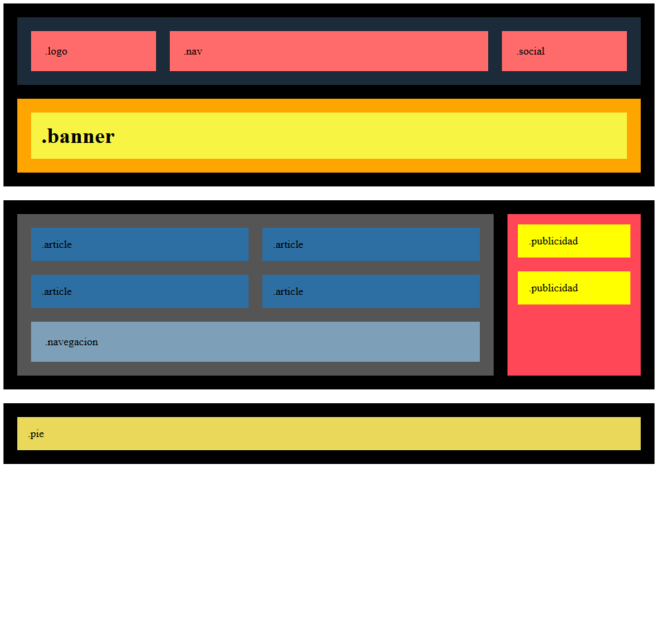
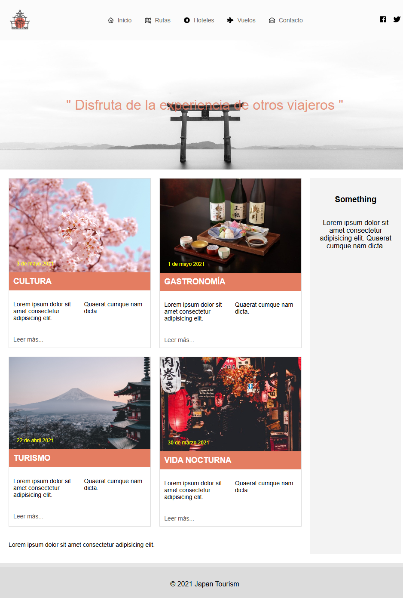

# Sprint 1 — Task 01: Layouts & PHP

## 📄 Description

This repository contains the exercises for **Sprint 1 — Task 01**.

In this task, a responsive layout was developed using **HTML and CSS**.
The layout adapts to different screen sizes and works correctly on:

- Desktop
- Tablet
- Mobile

## 🎯 Objectives

- Practice semantic HTML structure
- Work with **CSS Flexbox** and **CSS Grid**
- Implement responsive design using media queries

## 🛠 Technologies

- HTML5
- CSS3
- Flexbox
- CSS Grid
- Media Queries

## 🚀 Installation

Clone the repository:

```bash
git clone https://github.com/M3lgone/task-s1-01.git
```

Open the project folder and run it using a local server.

You can also open the `index.html` file directly in your browser.

## 📸 Preview

Below are some screenshots of the final result:

<p align="center">
  
  
</p>

## 📁 Project Structure

├── level-1/  
│ ├── index.html  
│ └── global.css  
├── level-2/  
│ ├── index.html  
│ └── global.css  
├── level-3/  
│ ├── index.html  
│ └── global.css  
├── assets/  
│ ├── images  
│ └── icons  
├── README.md

## ⭐ Exercises

This task includes **7 exercises**.

The number of completed exercises determines the **final score (stars)**:

⭐ **1 Star**  
Exercises 1, 2 and 3

⭐⭐ **2 Stars**  
Exercises 4 and 5

⭐⭐⭐ **3 Stars**  
Exercises 6 and 7

## ✅ Progress

- [x] 1. Desktop layout
- [x] 2. Tablet responsive layout
- [x] 3. Mobile responsive layout
- [x] 4. Header design and styling
- [x] 5. Articles section
- [x] 6. CSS keyframe animations
- [x] 7. Layout with CSS Grid
