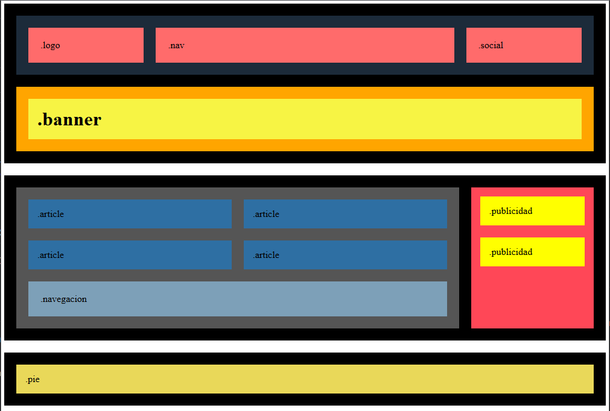

# Sprint 1 — Task 01: Layouts & PHP

## Description

This repository contains the exercises for **Sprint 1 — Task 01**.

In this task I created a responsive layout using **HTML and CSS**.  
The layout adapts to different screen sizes and works correctly on:

- Desktop
- Tablet
- Mobile

The objective of the task was to practice:

- HTML semantic structure
- CSS Flexbox
- CSS Grid
- Responsive design using media queries


## 🛠 Technologies

- HTML5
- CSS3
- Flexbox
- CSS Grid
- Media Queries


## 🚀 Installation

Clone the repository:

```bash
git clone https://github.com/M3lgone/tasca-s1-01.git
```

Open the project folder and run it using a local server.

Alternatively, you can open the `index.html` file directly in your browser.


## 📸 Preview

## 📸 Preview

<p align="center">
  
  
</p>


## ⭐ Exercises

This task contains **7 exercises**.

The number of completed exercises determines the **final score (stars)**:

⭐ **1 Star**  
Exercises 1, 2 and 3

⭐⭐ **2 Stars**  
Exercises 4 and 5

⭐⭐⭐ **3 Stars**  
Exercises 6 and 7
